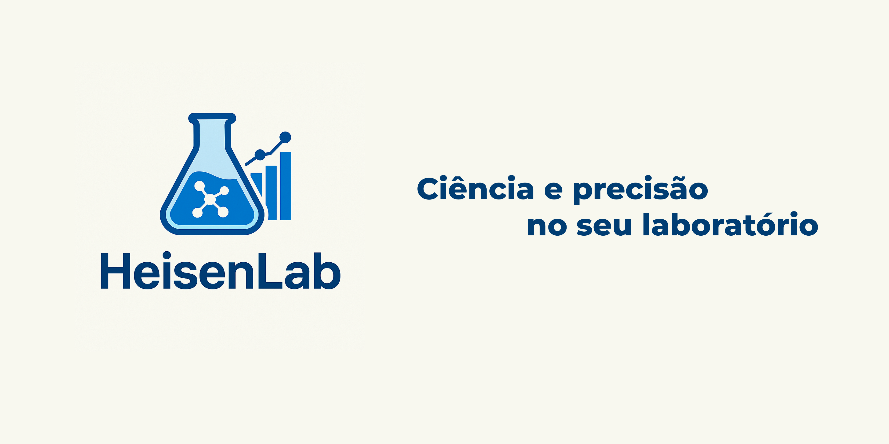

# HeisenLab

<p align="center">
  
</p>

<p align="center">
  <strong>Química Analítica • Interface Moderna • Cálculos Precisos</strong>
</p>

Aplicativo de Química Analítica com interface gráfica para cálculos químicos, voltamogramas e análise estatística. Desenvolvido com PySide6, matplotlib e numpy para máxima precisão e usabilidade.

## Funcionalidades

- **Cálculos Químicos**: Diluição, pH/pOH, constantes de equilíbrio (Ka/Kb), Lei de Beer-Lambert
- **Voltamograma**: Importação de dados Excel, visualização gráfica interativa
- **Propriedades & Conversões**: Massa molar, conversões de unidades, cálculos de densidade/molaridade
- **Estatística**: Análise descritiva, intervalos de confiança, testes t e F

## Instalação

### Opção 1: Instalador (Recomendado)
Baixe e execute o instalador `setup.exe` para instalação automática.

### Opção 2: Build from Source

**Pré-requisitos:** Python 3.8+

1. Clone o repositório:
```bash
git clone <repository-url>
cd HeisenLab
```

2. Crie e ative um ambiente virtual:
```powershell
python -m venv .venv
.\.venv\Scripts\Activate.ps1
```

3. Instale as dependências:
```powershell
pip install -r requirements.txt
```

4. Execute o aplicativo:
```powershell
python main.py
```
## Release v1.0

Foi disponibilizada a versão 1.0 do HeisenLab!

O instalador está disponível como `setup.exe` na seção de releases.

Para instalar:
1. Baixe o arquivo `setup.exe`.
2. Execute o instalador e siga as instruções na tela.

Em caso de dúvidas ou problemas, consulte este README ou entre em contato pelo canal de suporte.
## Dependências

- PySide6 (interface gráfica)
- matplotlib (gráficos)
- numpy, pandas (cálculos e dados)
- openpyxl (arquivos Excel)

## Estrutura do Projeto

```
HeisenLab/
├── main.py                    # Ponto de entrada
├── requirements.txt           # Dependências
└── heisenlab/                 # Pacote principal
    ├── calculations.py        # Cálculos químicos
    ├── plotting.py           # Funções de plotagem
    └── ui/                   # Interface gráfica
        ├── main_window.py    # Janela principal
        ├── calculations_tab.py
        ├── calibration_tab.py
        ├── properties_tab.py
        └── statistics_tab.py
```

## Autores

- **Lucas Cabral** - lucascabralp567@gmail.com
- **Artur Cesar**

Desenvolvido para o laboratório de química Analítica da Universidade Federal Fluminense (UFF).
