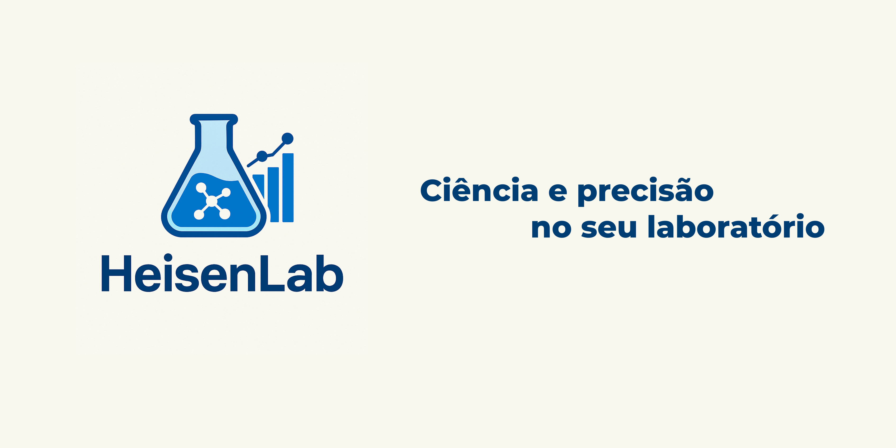
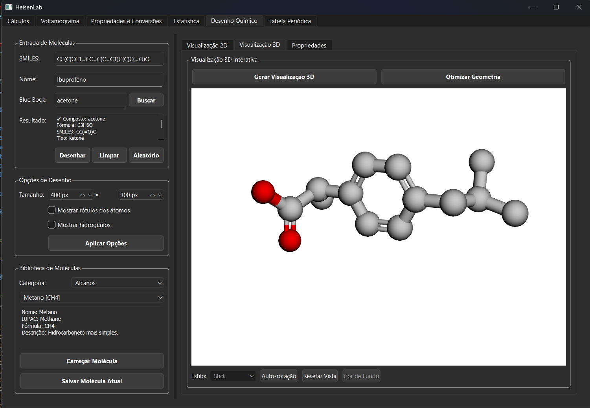

# HeisenLab

<p align="center">
  
</p>

<p align="center">
  <strong>Química Analítica • Interface Moderna • Cálculos Precisos</strong>
</p>

Aplicativo de Química Analítica com interface gráfica para cálculos químicos, voltamogramas e análise estatística. Desenvolvido com PySide6, matplotlib e numpy para máxima precisão e usabilidade.

## Funcionalidades

- **Cálculos Químicos**: Diluição, pH/pOH, constantes de equilíbrio, Lei de Beer-Lambert
- **Balanceamento de Equações**: Ferramenta automática para balancear equações químicas com renderização LaTeX
- **Tabela Periódica Interativa**: 118 elementos com busca, propriedades detalhadas e modelo atômico visual
- **Desenho Químico**: Editor de estruturas moleculares e funções orgânicas interativo
- **Voltamograma**: Importação e visualização de dados experimentais
- **Propriedades & Conversões**: Massa molar, densidade, molaridade e conversões de unidades
- **Análise Estatística**: Estatística descritiva, intervalos de confiança, testes t e F

## Exemplo - Desenho Químico

<p align="center">
  
</p>

<p align="center">
  <em>Interface do editor de estruturas moleculares com ferramentas de desenho interativas</em>
</p>

## Instalação

### 🐧 Linux (Instalação Automática)
```bash
# 1. Clone o repositório
git clone https://github.com/Cabral567/HeisenLab.git
cd HeisenLab

# 2. Execute o script de instalação
./install_linux.sh

# 3. Execute o HeisenLab
./run_heisenlab.sh
```

**Distribuições suportadas:** Ubuntu, Debian, Fedora, CentOS, Arch Linux, Manjaro

O script automaticamente:
- Detecta sua distribuição Linux
- Instala dependências do sistema (Qt6, Python, etc.)
- Cria ambiente virtual isolado
- Instala todas as dependências Python
- Adiciona atalho no menu de aplicações
- Cria script de desinstalação

### 🪟 Windows
```bash
# Baixe o arquivo setup.exe e execute
setup.exe
```
*Instalação automática com todas as dependências incluídas*

### 🔧 Instalação Manual (Todas as Plataformas)
```bash
# 1. Clone o repositório
git clone https://github.com/Cabral567/HeisenLab.git
cd HeisenLab

# 2. Crie ambiente virtual
python -m venv venv

# 3. Ative o ambiente virtual
# Windows (PowerShell):
venv\Scripts\Activate.ps1
# Windows (CMD):
venv\Scripts\activate.bat
# Linux/Mac:
source venv/bin/activate

# 4. Instale dependências
pip install -r requirements.txt

# 5. Execute a aplicação
python main.py
```

### Requisitos do Sistema
- **Python**: 3.8 ou superior
- **Sistema Operacional**: Windows 10+, Linux, macOS  
- **Memória RAM**: 4GB recomendado
- **Espaço em disco**: 2GB livres

### Solução de Problemas (Linux)

**Erro Qt6 não encontrado:**
```bash
# Ubuntu/Debian
sudo apt install qt6-base-dev

# Fedora
sudo dnf install qt6-qtbase-devel

# Arch Linux  
sudo pacman -S qt6-base
```

**Desinstalação (Linux):**
```bash
./uninstall.sh
```

## Principais Recursos

### Cálculos Químicos
Ferramentas para diluições, pH/pOH, constantes de equilíbrio e Lei de Beer-Lambert

### Balanceamento de Equações Químicas
Ferramenta avançada para balanceamento automático de equações químicas:
- Interface intuitiva para entrada de equações completas
- Balanceamento automático usando algoritmos ChemPy
- Renderização LaTeX para visualização profissional das equações
- Coeficientes estequiométricos detalhados
- Exemplos pré-definidos para facilitar o uso
- Validação de sintaxe com mensagens de erro educativas

### Tabela Periódica Interativa
- 118 elementos com interface visual moderna
- Busca por símbolo, nome ou número atômico
- Propriedades detalhadas e modelo atômico de Bohr
- Cores por categoria e layout responsivo

### Desenho Químico
Editor interativo para estruturas moleculares e funções orgânicas com:
- Ferramentas de desenho intuitivas
- Biblioteca de grupos funcionais
- Visualização 2D de moléculas
- Exportação de estruturas

### Análise de Dados
- Importação de voltamogramas (Excel)
- Análise estatística completa
- Gráficos interativos e personalizáveis

## Dependências

PySide6 • matplotlib • numpy • pandas • openpyxl • chempy

## Estrutura Principal

```
HeisenLab/
├── main.py                           # Aplicação principal
├── requirements.txt                  # Dependências
└── heisenlab/
    ├── calculations.py              # Cálculos químicos
    ├── plotting.py                  # Visualizações
    └── ui/                          # Interface gráfica
        ├── main_window.py           # Janela principal
        ├── calculations_tab.py      # Cálculos
        ├── equations_tab.py         # Balanceamento de equações
        ├── periodic_table_tab_final.py  # Tabela periódica
        ├── chemical_draw_tab.py     # Desenho químico
        ├── calibration_tab.py       # Voltamogramas
        ├── properties_tab.py        # Propriedades
        └── statistics_tab.py        # Estatística
```

## Autores

**Lucas Cabral** - lucascabralp567@gmail.com
**Artur Cesar** - cesarr7907@gmail.com

Laboratório de Química Analítica - Universidade Federal Fluminense (UFF)
